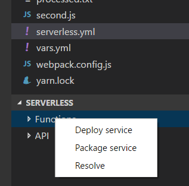
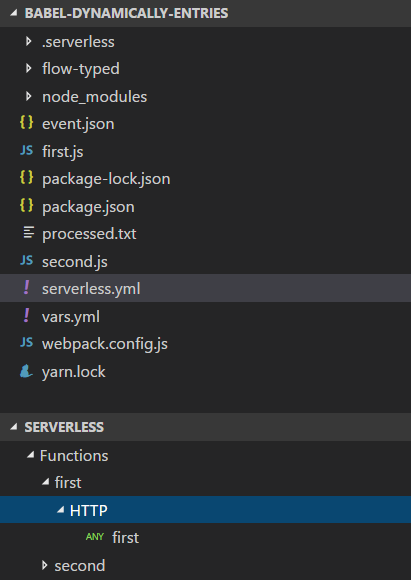
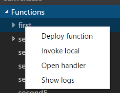

## Serverless Framework integration for VS Code

This extension enables an integration of Serverless projects with VSCode. It eliminates the need
to start Serverless commands from a separate command line.

## Installation

In order to install an extension you need to open the extension palette and search for serverless-vscode.
You can then install it.

### Alpha version

This is currently an alpha version, that integrates only a subset of possible commands.
See the GitHub repository for remaining planned features for the final version. You're encouraged to
test the version and create additional feature requests.

**Currently the extension only supports Serverless projects with Serverless installed locally!**

That means, that Serverless must be a development dependency of the project itself. A subsequent
version of the extension will also support the globally installed Serverless framework and a
configuration for that.

## Configuration

The extension supports user and workspace configuration. To access the configuration settings,
open `File->Preferences->Settings` (workspace or user) and expand the `Serverless Configuration` node.

The following configuration settings are available:

### serverless.aws.askForRegion

When set to false (the default), the extension will not ask for the region to deploy to but use the
one, set as `serverless.aws.defaultRegion`. This reduces the typing needed to execute a single
command, as normally you'll not deploy cross-region that often.

### serverless.aws.defaultRegion

The defult stage that is assumed, if you just press ENTER in the stage input field when executing a command.

### serverless.aws.defaultStage

The defult region that is assumed, if you just press ENTER in the stage input field when executing a command. See also `serverless.aws.askForRegion`.

## Usage

### The Serverless outline

As soon as you have added a Serverless project to your workspace, you can select the `serverless.yml`
in the Explorer tree view. Then an outline is shown in the Explorer view, that shows the parsed
structure of your Serverless service definition.
The outline will contain a `functions` and an `API` hive, which contain the defined functions in the
project and the defined API endpoint hierarchy. Each item in the outline has a context menu that allows
access to context specific commands. Most of the command will ask you for the target stage when triggered.

#### Top container objects

Each of the top hives has a context menu that lets you invoke service/project related functions.

##### Package

Package will ask for the stage and optionally region and packages the service with `serverless package`.

##### Deploy

Package will ask for the stage and optionally region and deploys the service with `serverless deploy`.

##### Variable resolution (Resolve)

Resolve allows you to show a generated `resolved.yml`, i.e. your `serverless.yml` with all Serverless
variables resolved to their values for a selected stage.

#### Functions

The functions hive lets you analyze your service function-wise and contains a node for each function.
Each function then contains a list of all defined HTTP endpoints in the function definition.

All function related commands of the extension can be called via the context menu of the function.

##### Deploy function

Deploys the selected function with `serverless deploy function`. Attention: In general, single function
deployment does not replace a service deployment. See the Serverless documentation for details.

##### Invoke local

Invoke the selected function locally. The command lets you select an `event.json` that will be used
for the local invocation. Setting a custom context is not yet possible.

##### Show logs

Retrieve and show the online logs of the deployed function in the output pane.

##### Open handler

Open the handler source file that is associated with the function.

#### API

The API hive shows the combined API that will eventually be deployed to API Gateway.

## Releases

*0.0.4*
Support package and deploy [#10](https://github.com/HyperBrain/serverless-vscode/issues/10)
Support region and default configuration [#11](https://github.com/HyperBrain/serverless-vscode/issues/11)

*0.0.3*
Added API hive

*0.0.2*
Initial alpha release
